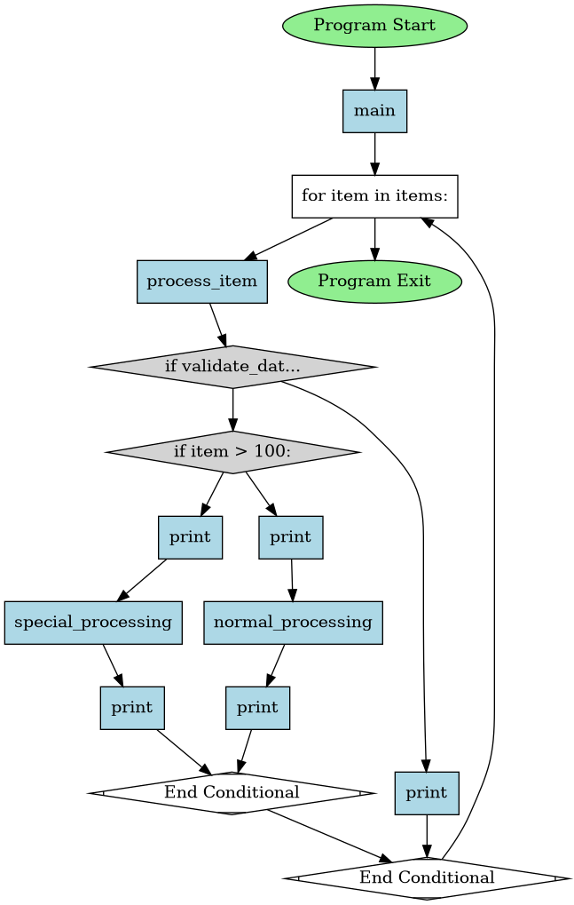
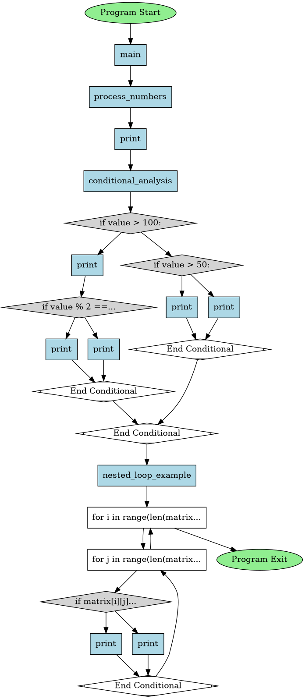

## Python Call Trace

This is a tool that captures the order in which the functions may be called in
an actual execution of a python file. 
It takes an input a python file and produces an output graph as an image.

### Usage: 

#### Quick Usage Guide:
> If you have a python environment setup, you can run the following command
> ```python 
> pip install -r requirements.txt
> python main.py 
> ```

#### Detailed Usage Guide:
In order to use this program, you must have python installed. It is also
recommended to use python in a virtual environment.

This package has only one dependency, which is `graphviz` for displaying graph
as an image. On a unix-based environment, `pip` won't probably allow you to
install any package without any virtual environment enabled. There are several
virtual environment handlers, (I use `pyenv`, `conda` is popular too). There is
a native python package called `venv` which is also good.

To create and activate an environment, run the following command:
```bash
python -m venv ./venv
source ./venv/bin/activate
pip install -r requirements.txt
```
In case it says, `venv is not installed/found`, See how to [install
venv](https://packaging.python.org/en/latest/guides/installing-using-pip-and-virtual-environments/)

Now your virtual environment is ready. You can run the program by:
```python 
python main.py 
```

### Assumptions:
- The tool expects input source file to have an entry point `main()` function.

### Graphs:
There are sample inputs and outputs in the `input/` and `output/` directory, For a glimpse, I am attaching some of them here. <br>
*Click to see the images.*


| |   |  |
|:-----------------:|:-----------------:|:----------------:|

### Authors:
- **Syed M. Abbas Haider Taqvi** - [@smabbasht](https://www.github.com/smabbasht)
